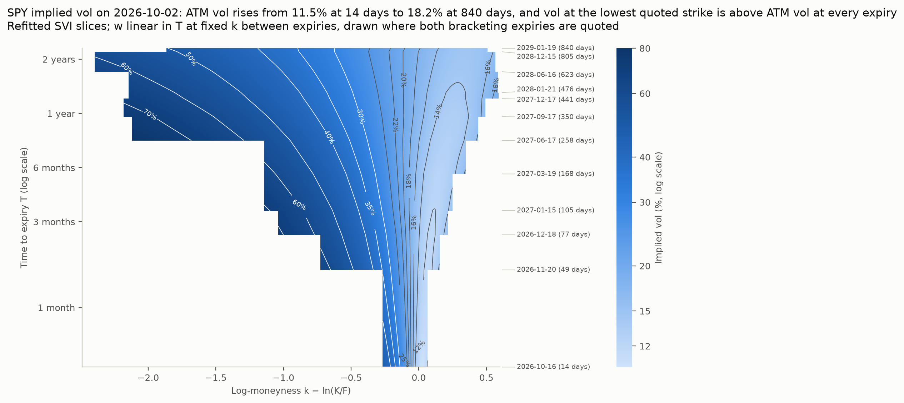
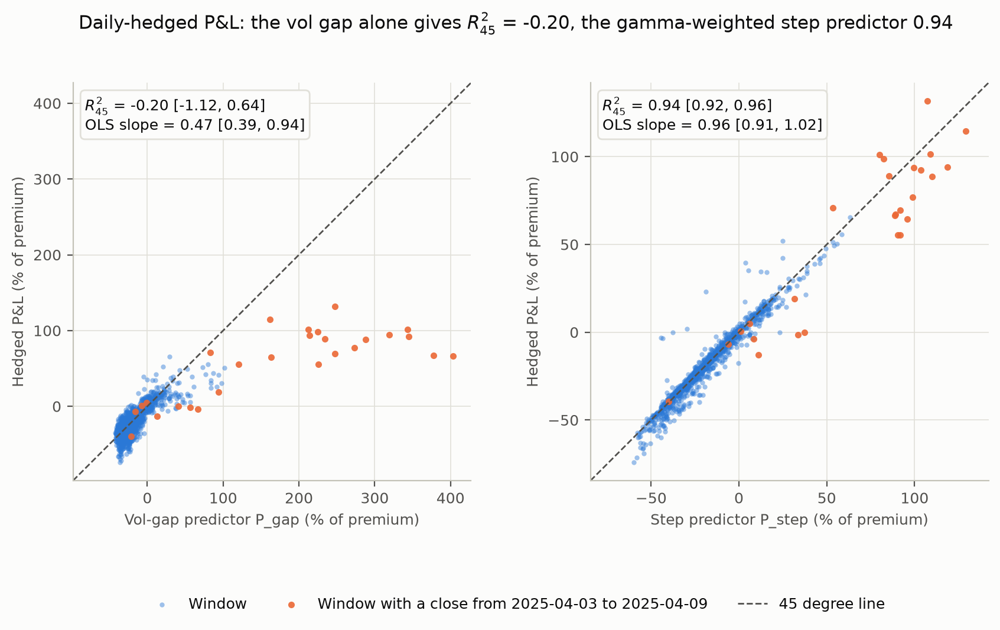

# vol-surface-delta-hedging

SPY implied volatility surface construction and delta-hedging P&L attribution.

**Status:** Complete

## Research question

> Given real SPY option prices, can I build an implied volatility surface free of static
> arbitrage, and when an option is delta-hedged over a historical period, how much of its
> hedged P&L is explained by the gap between realised and implied volatility?

## Headline result

Surface. Across 12 SPY expiries from 14 days to 2.3 years (snapshot of 2 October 2026), an SVI surface fit market implied vols within 0.33 vol points near the money and, after a constrained refit, was certified free of butterfly and calendar arbitrage on an independent 60,001-point grid. On each of three snapshot days its 30-day variance-swap vol came within 0.4 vol points of VIX.

Hedging. Over 1,232 thirty-day windows from October 2021, implied vol (VIX) exceeded subsequent realised vol in 84% of windows, and delta-hedged ATM SPY calls priced at VIX lost 18% of premium on average. Priced at their own 30-day ATM implied vol (OptionMetrics, 982 windows to August 2025) they broke even (+1%, 95% CI -4% to +8%): VIX sat 3.0 vol points above ATM vol on average across 1,068 trading days, and the smile's skew and curvature explain 71% of that gap's day-to-day variation. The exact expectation BS(sigma\_realised) - BS(sigma\_implied) explained R-squared = 0.58 of hedged P\&L through April 2025, where the textbook vol-gap predictor, which uses only the initial gamma, failed (R-squared -0.20).

## Figure 3: Implied volatility surface



Butterfly-freeness is certified on the fitted slices. Between them, w is interpolated linearly in T at fixed k, which preserves the calendar order of the slices; only Gatheral-Jacquier price interpolation would also guarantee butterfly-freeness between slices.

## Method

The binding decisions, formulas and acceptance values are in [docs/DESIGN.md](docs/DESIGN.md). The notebook [notebooks/analysis.ipynb](notebooks/analysis.ipynb) prints every number quoted in this README.

- **Data and cleaning.** Daily SPY, ^VIX and ^IRX closes from yfinance (adjusted, so dividends sit in the SPY series) and three SPY option chain snapshots from Yahoo, all frozen in `data/frozen/` with a manifest. Each chain keeps the monthly expiries, then the quarterly and January LEAPS expiries beyond a year, and the strikes where both the call and the put have a two-sided quote. It then drops zero bids, wide spreads and thin open interest.
- **Parity forwards and American exercise.** Each expiry's forward comes from put-call parity, a weighted least-squares fit of C - P on K with the discount factor fixed by the ^IRX rate. The fit uses strikes at or just below the spot, where the American put is out of the money and its early-exercise premium is smallest. The out-of-the-money selection switches from puts to calls at the spot at the quote time (the SPY 1-minute bar nearest the latest option trade) rather than at the forward. No put that is in the money against the spot therefore enters a smile.
- **Implied vols.** Black-76 in forward form, inverted with Brent's method after a bracket check. A price outside the no-arbitrage bounds gets no implied vol, and the quote is dropped. A Newton demonstration on a deep out-of-the-money put shows why a naive start diverges and the Manaster-Koehler start converges.
- **SVI, constrained refit and certification.** Raw SVI on each expiry, calibrated by the Zeliade quasi-explicit method with vega weights, Lee's moment bound and the vertex held inside the quoted range. A direct five-parameter fit cross-checks it. A constrained refit, shortest expiry first, adds butterfly (g(k) ≥ 0) and calendar (w rising in T) constraints, with exchange rounds that add any violating point found between grid nodes. The final surface is certified on a 60,001-point grid that never served as a constraint.
- **Variance-swap bridge.** A 30-day slice, linear in total variance between the bracketing expiries, gives the variance-swap vol by replication over the quoted strikes. The CBOE discrete formula cross-checks it. The bridge reports its gap to the 30-day ATM vol, with VIX at the quote time alongside.
- **Three-snapshot stability check.** The whole surface pipeline runs on the snapshots of 2026-09-30, 2026-10-01 and 2026-10-02, and every acceptance value holds on all three. The primary snapshot, 2026-10-02, was picked by a rule fixed before any result was computed: among the snapshots whose minute bars were saved at pull time, the one with the lower median bid-ask spread near the money.
- **Hedging engine and its validation.** On every trading day from October 2021, a 30-day European ATM call struck at the forward is bought at VIX. It is delta-hedged at the close every h trading days, counted back from expiry, with cash at the ^IRX rate and stock trading costs in bp. P&L is a fraction of the premium carried to expiry. On GBM paths the engine is checked against the Derman-Kamal hedging-error formula and against the exact expected P&L of a mispriced option. It is also checked against put-call parity: a hedged call and a hedged put with the same strike give the same P&L path by path.
- **The R-squared ladder.** Four predictors of each window's hedged P&L run from the vol gap alone to the realised path:
  - P_gap: vega times the variance gap.
  - P_price = BS(σ_r) - BS(σ_i): the exact expectation under GBM.
  - P_path: the gap weighted by the path's own gamma.
  - P_step: each interval's squared return against its gamma.

  Each predictor gets R-squared about the 45 degree line and the OLS R-squared and slope. They are judged against a GBM benchmark built on the same calendars and vols.
- **OptionMetrics comparison.** The 30-day ATM implied vol from licensed OptionMetrics data replaces VIX as the pricing vol on the same windows, up to August 2025. The daily VIX minus ATM gap is regressed on the 30-day risk reversal and butterfly.
- **Block bootstrap and stride subsamples.** Overlapping windows are not independent, so intervals come from a moving block bootstrap over windows in start order (blocks of 42 windows, with 84 and 126 as a sensitivity). The 22 non-overlapping subsamples at a stride of 22 windows measure sensitivity to window alignment, not sampling error.

## Figure 6: Hedged P&L vs variance gap



## Limitations

- **American options priced as European.** SPY options are American. Pricing out-of-the-money quotes with Black-76 leaves a small early-exercise bias, largest for long-dated puts, and the parity forwards keep a small bias of their own. The put-to-call switch sits at the spot rather than the forward, so that no put in the money against the spot enters a smile. That choice rests on the early-exercise argument: the smaller switch step it was meant to give held on every expiry of one snapshot but not of the other two. A binomial de-Americanisation of the prices is the fix, left as an extension.
- **VIX as an SPX variance-swap level.** VIX is a variance-swap level, so it sits above ATM vol by the variance-swap gap; Table 4e reprices with that gap removed. It is also an SPX level, while the hedged underlying and the OptionMetrics ATM vol are SPY, so pricing at VIX carries any difference between SPX and SPY implied vol.
- **Overlapping windows.** Consecutive 30-day windows share most of their daily returns, so they are not independent observations. The intervals are moving block bootstrap intervals, and the stride subsamples show sensitivity to window alignment; neither makes the windows independent.
- **One surface per snapshot.** Each surface describes one moment, from Yahoo quotes about 15 minutes old, and mids from wide markets are noisy. The pipeline was rerun on three snapshot days. Every acceptance value held on all three, and the 30-day variance-swap vol came within 0.4 vol points of VIX each time, but three days say nothing about how the surface moves over time.
- **Flat ^IRX discounting and the low long-dated carry.** One flat bill rate (^IRX) discounts every expiry. Under it, and even under the Treasury curve, the implied carry of the long expiries sits below SPY's dividend yield. This is consistent with option-implied financing rates above Treasury yields (van Binsbergen, Diamond and Grotteria, 2022, Journal of Financial Economics). A rule fixed before the comparison keeps the flat rate as the default.
- **Licensed OptionMetrics data.** The OptionMetrics files come from WRDS under licence and are never redistributed. The repository holds none of their rows, and the notebook and figures show only aggregates and monthly means. Without the files in `data/raw/`, the OptionMetrics section prints one line and skips, so a clean install still runs top to bottom. The committed notebook outputs and Figure 7b come from a run with the files present. The comparison covers windows starting up to 2025-08-29.

## How to run

The pins were tested with Python 3.12. The analysis reads only `data/frozen/`; nothing is downloaded unless a refresh is requested explicitly through `volsurf.data`. The OptionMetrics section also needs the two licensed WRDS files, `om_spy_std_30d_2021_2025.csv` and `om_spy_volsurf_2021_2025.csv`, in `data/raw/`.

Windows:

```
git clone https://github.com/yogi-agarwal/vol-surface-delta-hedging.git
cd vol-surface-delta-hedging
py -3.12 -m venv .venv
.venv\Scripts\python -m pip install -r requirements.txt
.venv\Scripts\python -m pip install -e .
.venv\Scripts\python -m pytest -q
.venv\Scripts\python -m jupyter nbconvert --to notebook --execute --inplace notebooks/analysis.ipynb
```

macOS and Linux:

```
git clone https://github.com/yogi-agarwal/vol-surface-delta-hedging.git
cd vol-surface-delta-hedging
python3.12 -m venv .venv
.venv/bin/python -m pip install -r requirements.txt
.venv/bin/python -m pip install -e .
.venv/bin/python -m pytest -q
.venv/bin/python -m jupyter nbconvert --to notebook --execute --inplace notebooks/analysis.ipynb
```

The pins in `requirements.txt` were frozen and tested on Windows. Two of them, colorama and pywinpty, carry a Windows-only marker. pip finds a wheel for every other pin on Linux (manylinux_2_28, x86_64) and on macOS 14 (arm64), and also installs pexpect and ptyprocess there (and appnope on macOS), which the Windows freeze does not pin. The macOS and Linux installs themselves have not been run.
